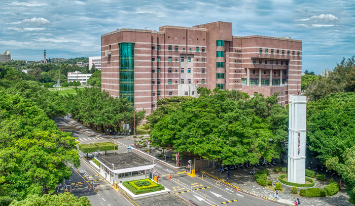

::: {style="margin-bottom:50px;"}
:::

## Master of Science: Statistics

National Tsing Hua University, Hsinchu, Taiwan

-   **Graduated:** July 2023\
-   **Advisor:** [Dr. Longcheen Huwang](https://stat.site.nthu.edu.tw/p/406-1327-4323,r406.php?Lang=en)
-   **Thesis**: "Change-point detection EWMA control charts for monitoring Weibull scale parameter"

::: {style="margin-bottom:20px;"}
:::

::: {style="margin-bottom:20px;"}
:::

## Bachelors of Science: Mathematics

National Tsing Hua University, Hsinchu, Taiwan

-   **Graduated:** June 2021\
-   List your achievements

::: {style="margin-bottom:20px;"}
:::

## Honors & Awards

-   List cool things here
